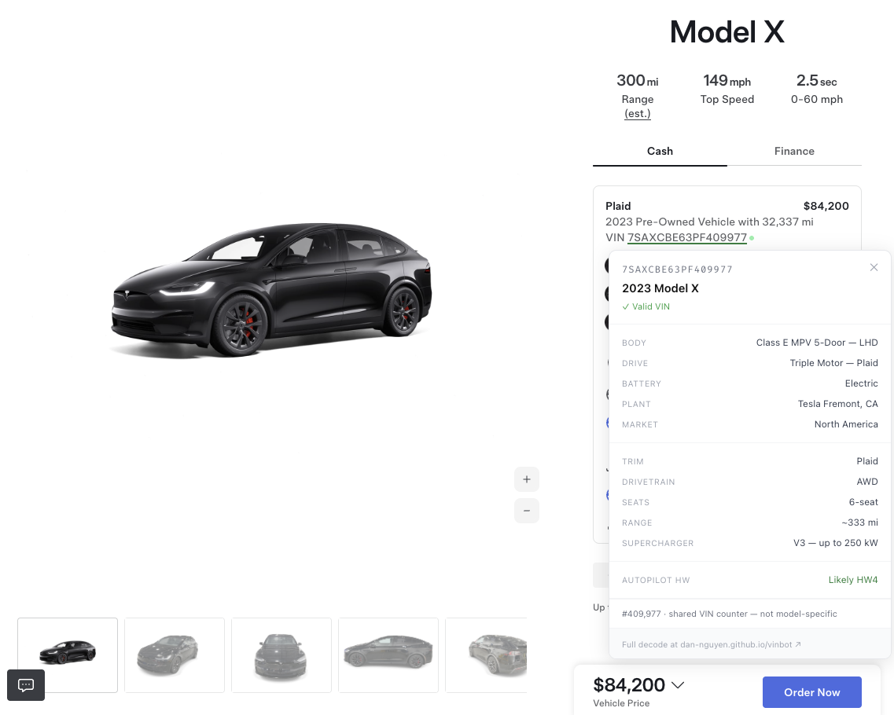

# vin-userscripts

Browser extensions for [vinbot](https://github.com/dan-nguyen/vinbot) — a Tesla VIN decoder.

Auto-detects Tesla VINs on any webpage and shows a decoded popup on click.

*Example from Tesla.com website*

## Included

| Extension | Description |
|-----------|-------------|
| `tampermonkey.js` | Userscript for [Tampermonkey](https://www.tampermonkey.net/) (Chrome, Firefox, Edge, Safari) |
| `chrome-extension/` | Native Chrome extension (no extra app required) |

## Install

### Tampermonkey userscript

1. Install [Tampermonkey](https://www.tampermonkey.net/) for your browser
2. Download [`tampermonkey.js`](../../releases/latest) from the latest release
3. Open Tampermonkey → Create new script → paste the contents → Save

### Chrome extension

1. Download `chrome-extension.zip` from the [latest release](../../releases/latest) and unzip it
2. Open `chrome://extensions` in Chrome
3. Enable **Developer mode**
4. Click **Load unpacked** and select the unzipped folder

## Source

The VIN decoder itself lives at [dan-nguyen/vinbot](https://github.com/dan-nguyen/vinbot).
